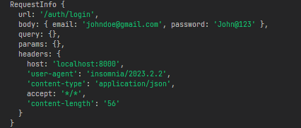

# Node Express Template

This is a template repository for creating a Node.js web application using the Express framework. It provides a basic structure and configuration to kickstart your project development.

## Features

- Express server setup
- Customised folder structure
- Sample routes and controllers
- Zod configured and typesafe
- Middlewares configured (Error,Validate,Logger)

## Getting Started

To get started with this template, follow the instructions below:

### Prerequisites

- Node.js (version 14 or higher)
- npm (Node Package Manager)

### Installation

1. Clone the repository:

```bash
git clone https://github.com/nisabmohd/node-express-template.git
```

2. Change to the project directory:

```bash
cd node-express-template
```

3. Create .env in root folder

```bash
PORT=8000
MONGO_URI=mongodb://localhost:27017/test
LOGGER=true
```

##### Note : if there is no env file or misamtch type of env varaibles from src\utils\validationEnv.ts schema doesn't match server will not start


if `LOGGER=true` added in .env file then you can log the requestInfo



4. Install the dependencies:

```bash
npm install
```

### Running the Server

To start the dev server, use the following command:

```bash
npm run dev
```

The server will start running on `http://localhost:8000`. You can access it in your browser or through API clients like Postman,Insomnnia.

### Development Mode

During development, you can use the following command to run the server with automatic reloading on file changes:

```bash
npm run dev
```

## Contributing

If you want to contribute to this template, feel free to submit a pull request. Contributions, bug reports, and feature requests are always welcome!

## Acknowledgements

This template was created by [nisabmohd](https://github.com/nisabmohd) and is inspired by various Node.js and Express project structures and best practices.
